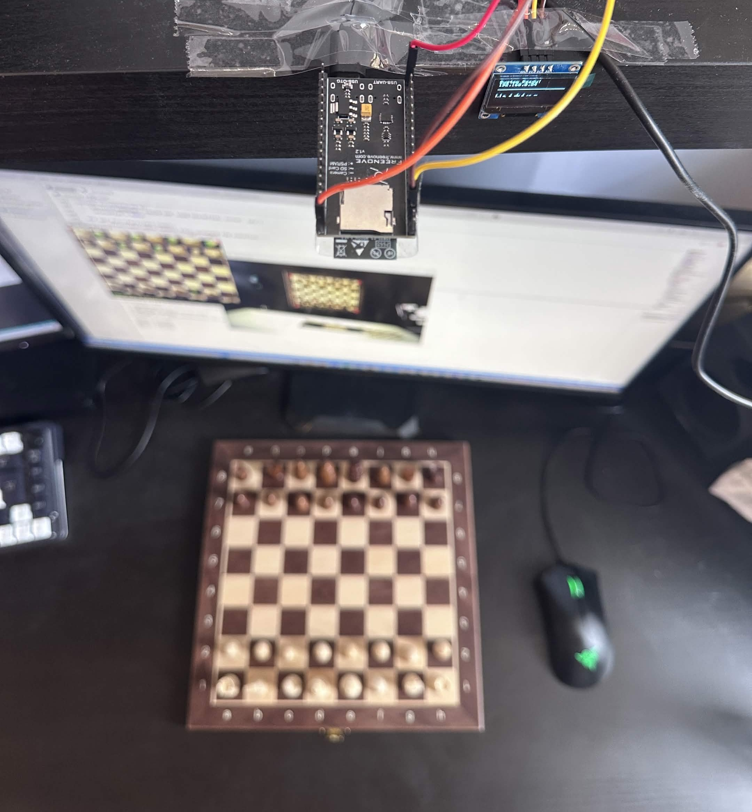

# Vision-Based Chess AI Assistant

## Overview
This project bridges the gap between Over-The-Board chess and digital AI analysis. Using an **ESP32-S3 Camera**, the system captures live images of a physical chessboard. A custom-trained **YOLOv8** object detection model (`vision.py`) identifies the pieces and board state. This state is then fed into the **Stockfish** chess engine (`jstockfish.exe`) to analyze the position and calculate the optimal next move in real-time

## ESP32-S3 firmware architecture

The embedded C++ firmware leverages the **FreeRTOS** real-time operating system to maximize the ESP32-S3s dual-core processor. This ensures smooth video streaming without bottlenecking hardware interactions or dropping data.

*   Asymmetric Dual-Core Processing:
    *   Core 0 is dedicated exclusively to heavy network traffic, handling the MJPEG video stream and HTTP REST endpoints.
    *   Core 1 handles local hardware tasks (I2C OLED updates and Health LED toggling), preventing network latency from causing hardware stuttering or watchdog timer resets.
*   Multi-Port Asynchronous Networking: Configured two distinct HTTP servers to split traffic. Port 81 handles continuous, high-bandwidth `multipart/x-mixed-replace` video streaming, while Port 80 serves a lightweight REST API and a fallback web UI.
*   Concurrency & Thread Safety: Implemented **FreeRTOS Mutexes** (`SemaphoreHandle_t`) to prevent race conditions when asynchronous web requests modify the system's state. Utilized **FreeRTOS Queues** (`QueueHandle_t`) for thread-safe inter-task communication, passing text seamlessly from the networking core to the OLED display core.
*   Flash-Optimized Web Server: Embedded a fallback HTML/JS interface directly into the ESP32's flash memory using raw string literals. This allows the ESP32 to serve a standalone remote control to smartphones if the PC vision pipeline goes offline.

## Features
*   Edge vision streaming: Lightweight, low-latency image streaming directly from an ESP32-S3 microcontroller over WiFi
*   Advanced AI vision: Employs a state-of-the-art YOLOv8 model (`yolov8_chess.pt`) specifically trained to recognize chess pieces from various lighting conditions and angles
*   Grandmaster level chess analysis: Integrates the Stockfish engine to evaluate physical board positions and suggest the best moves
*   Automated pipeline: Seamlessly handles the transition from physical image -> bounding boxes -> FEN (Forsyth-Edwards Notation) -> Stockfish move calculation.

## Technologies used
**Hardware:**
*   ESP32-S3 Camera Module
*   Standard Physical Chessboard and Pieces
*   Mounting hardware/stand for overhead camera view

**Software & Machine Learning:**
*   Python 3.14.4: Core backend logic (`vision.py`, `download_yolo.py`)
*   C++ (Arduino Framework): ESP32-S3 firmware (`ESP-32.ino`)
*   Ultralytics YOLOv8: Object detection architecture
*   OpenCV: Image processing and stream handling
*   Stockfish: Open-source chess engine

## Hardware Setup

To achieve the best results, the ESP32-S3 Camera should be mounted securely above the chessboard, providing a clear, relatively top-down view of all chess squares



*Tip: Ensure your lighting is even across the board to prevent harsh shadows that might confuse the YOLO model.*

## Project structure
```text
.
├── ESP-32/
│   └── ESP-32.ino          # Firmware for the ESP32-S3 Camera to stream video
├── jstockfish.exe          # Stockfish chess engine executable
├── yolov8_chess.pt         # Pre-trained YOLOv8 model weights for chess pieces
├── vision.py               # Main Python script: handles CV, YOLO inference, and Stockfish logic
├── download_yolo.py        # Utility script to download/update the YOLO model
└── README.md               
```

## Getting started
### 1. Hardware Initialization (ESP32-S3)
- Open ESP-32/ESP-32.ino in the Arduino IDE
- Configure your WiFi credentials (SSID and Password) within the sketch
- Select the appropriate ESP32-S3 Dev Module board and COM port
- Compile and upload the code
- Open the Serial Monitor to get the IP address of the camera stream

### 2. Software Installation (Python Backend)
- Clone this repository
- Install the required Python dependencies:
``` bash
pip install ultralytics opencv-python requests
```
- Run the YOLO setup script to ensure you have the required model files (if not already present):
``` bash
python download_yolo.py
```
### 3. Running the AI
- Update vision.py with the IP address outputted by your ESP32-S3 camera
- Ensure the board is set up and well-lit
- Execute the vision script:
``` bash
python vision.py
```
- The system will open a video feed, draw bounding boxes around detected pieces, and output the best move calculated by Stockfish in the console!